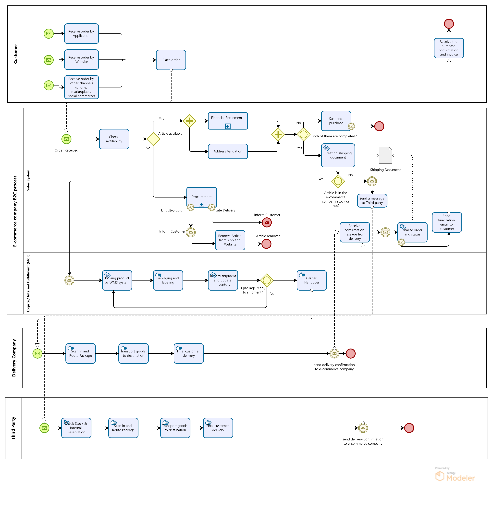

# B2C Order Fulfillment Process
### Business Process Analysis and BPMN Modeling | Nasim Maleki

---

## Introduction

This project documents the end to end Business to Consumer (B2C) order fulfillment process of an e commerce company, modeled in BPMN 2.0 using Bizagi Modeler. It captures how a customer order travels from the moment it is placed, through validation and fulfillment, all the way to final delivery and confirmation.

The aim of the model is to give a clear, shared picture of how the process actually works across every team and system involved. A well documented process like this is the starting point for spotting bottlenecks, clarifying responsibilities, and identifying where automation or improvement could add value.

> Company specific names have been replaced with generic terms (for example "the e commerce company") to respect confidentiality, while keeping the process logic fully intact.

---

## Process Diagram

*The full BPMN model is also available as an editable Bizagi source file in this repository.*

---

## 1. Process Overview

This document describes the Business to Consumer (B2C) order fulfillment process for an e commerce company. The process covers the complete journey of a customer order, from the moment it is placed through to final delivery and confirmation.

The process begins when a customer places an order through one of several channels: the mobile application, the website, or other sales channels such as phone, marketplace, or social commerce. It ends when the customer receives a final confirmation, together with the purchase invoice, verifying that the order has been completed and delivered.

The overall goal is to fulfill customer orders reliably regardless of the channel used, while handling two distinct fulfillment routes: items shipped directly from the company's own stock through its internal logistics, and items that are out of stock and must be fulfilled through a third party partner. The process also accounts for exception scenarios such as unavailable articles, incomplete financial settlement or address validation, and undeliverable items.

---

## 2. Scope and Participants

The process is organized into five participants, each shown as a swimlane in the BPMN diagram. Separating the work this way makes it easy to see who is responsible for what, and where handovers happen between teams and systems.

| Participant | Role in the Process |
|-------------|---------------------|
| **Customer** | Starts the process by placing an order through any available channel, and later receives the final delivery confirmation and invoice. |
| **Sales System** | Acts as the central coordination layer. It receives the order, checks availability, runs financial settlement and address validation, creates the shipping document, decides the fulfillment route, and sends the final confirmation to the customer. |
| **Logistic / Internal Fulfillment (MCF)** | Handles fulfillment from the company's own stock. It picks the product using the WMS, packages and labels it, records the shipment, updates inventory, and hands the package to the delivery company. |
| **Delivery Company** | Collects the package from internal logistics, routes and transports it to the customer, completes the final delivery, and sends a delivery confirmation back to the company. |
| **Third Party** | Fulfills orders when the article is not in the company's own stock. It checks its own stock and reservation, routes and transports the package, delivers to the customer, and sends a delivery confirmation back to the company. |

**Process boundaries**

- **Start:** a customer order is received by the Sales System from any channel.
- **End:** the customer receives the final confirmation and invoice from the company.

**Out of scope:** payment processing beyond the financial settlement check, returns and refunds, and post delivery customer service.

---

## 3. Trigger, Inputs, and Outputs

**Trigger**

The process is triggered when a customer places an order through any of the available sales channels (application, website, or other channels). This generates an order that is received by the Sales System.

**Inputs**

- Customer order details, including items and quantity
- Delivery address
- Payment information for financial settlement

**Outputs**

- A validated and settled order
- A shipping document
- A delivered package, fulfilled either through internal logistics or a third party
- A final confirmation and invoice sent to the customer

**Key systems and artifacts**

- **Sales System**, which coordinates the order from receipt to finalization
- **WMS (Warehouse Management System)**, used for product picking and inventory updates
- **Shipping Document**, generated during the process and shared with the third party where relevant

---

## 4. Process Flow

The sections below walk through the process step by step, following the order of events across each swimlane.

### Order Placement (Customer)

1. The customer places an order through one of the available channels: the mobile application, the website, or other sales channels such as phone, marketplace, or social commerce.
2. The order is submitted and transmitted to the company's Sales System.

### Order Receipt and Availability Check (Sales System)

3. The Sales System receives the order. This is marked as "Order Received".
4. The system checks article availability.
5. A decision point determines whether the article is available:
   - **If available (Yes):** the process moves forward to financial and address validation.
   - **If not available (No):** the process moves to Procurement.

### Validation (Sales System)

6. When the article is available, two activities run in parallel: Financial Settlement and Address Validation. Running them at the same time rather than one after the other helps keep processing time short.
7. The process waits until both activities are completed before moving on.
8. A decision point then checks whether both were completed successfully:
   - **If not both completed (No):** the purchase is suspended and the process ends for that order.
   - **If both completed (Yes):** the system proceeds to create the shipping document.

### Procurement Path (Sales System), when the article is unavailable

9. If the article is not available, the Procurement sub process is triggered to source it.
10. Procurement can lead to two outcomes:
    - **Undeliverable:** the customer is informed, the article is removed from the app and website to prevent further orders, and the process ends.
    - **Late Delivery:** the customer is proactively informed of the delay, and the process continues.

### Shipping Document and Fulfillment Routing (Sales System)

11. Once the validations pass, the system creates the shipping document.
12. A decision point checks whether the article is in the company's own stock:
    - **If Yes (in own stock):** fulfillment is routed to internal Logistics (MCF).
    - **If No (not in own stock):** a message is sent to the Third Party to fulfill the order.

### Internal Fulfillment (Logistic / Internal Fulfillment, MCF)

13. The product is picked using the WMS (Warehouse Management System).
14. The package is packaged and labeled.
15. The shipment is recorded and inventory is updated.
16. A decision point checks whether the package is ready for shipment:
    - **If not ready (No):** it loops back for reprocessing.
    - **If ready:** the package proceeds to Carrier Handover.
17. The package is handed over to the Delivery Company.

### Delivery (Delivery Company)

18. The delivery company scans in and routes the package.
19. The goods are transported to the destination.
20. Final customer delivery is completed.
21. A delivery confirmation is sent back to the company.

### Third Party Fulfillment (Third Party), when not in own stock

22. The third party checks its stock and internal reservation.
23. The package is scanned in and routed.
24. The goods are transported to the destination.
25. Final customer delivery is completed.
26. A delivery confirmation is sent back to the company.

### Finalization (Sales System to Customer)

27. The Sales System receives the delivery confirmation message.
28. The order and its status are finalized.
29. A finalization email is sent to the customer.
30. The customer receives the final confirmation and invoice, which completes the process.

---

## 5. Business Rules and Decision Points

The process contains four decision points, shown as gateways in the diagram. Each one enforces a clear business rule.

| Decision Point | Business Rule |
|----------------|---------------|
| **Article available?** | If the ordered article is in stock, the order proceeds to validation. If not, the Procurement sub process is triggered to source it. |
| **Both validations completed?** | The order may only move to shipping if both Financial Settlement and Address Validation are completed successfully. If either is incomplete, the purchase is suspended. |
| **Article in the company's own stock?** | If the article is in the company's own stock, it is fulfilled through internal Logistics (MCF). If not, fulfillment is routed to the Third Party partner. |
| **Package ready for shipment?** | The package may only proceed to Carrier Handover once it passes the readiness check. If it is not ready, it loops back for reprocessing. |

**Parallel processing rule.** Financial Settlement and Address Validation are carried out at the same time rather than one after the other. The process then synchronizes, waiting for both to finish before continuing. This keeps the validation stage as quick as possible without skipping either check.

---

## 6. Exception Handling

A strong process does not only describe the ideal path. It also shows what happens when things go wrong. This model handles three exception scenarios explicitly.

| Exception | Trigger | How It Is Handled |
|-----------|---------|-------------------|
| **Suspended Purchase** | Financial Settlement or Address Validation is not completed | The purchase is suspended and the order is closed before any shipping takes place. |
| **Undeliverable Article** | Procurement cannot source the requested article | The customer is informed, and the article is removed from the app and website so no further orders can be placed for it. |
| **Late Delivery** | Procurement can source the article, but with a delay | The customer is proactively informed of the delay, and the process then continues toward fulfillment. |

**Reprocessing loop.** Within internal logistics, if a package fails the shipment readiness check, it is sent back for reprocessing rather than being shipped incomplete or incorrect. This protects the customer experience by catching problems before the package leaves the warehouse.

---

## 7. Key Takeaways

This model demonstrates several practices that matter in real business process work:

- **Clear ownership.** Every activity sits in a swimlane, so responsibility is never ambiguous and handovers between teams and systems are easy to see.
- **Parallel work where it helps.** Financial and address checks run together, which shortens the validation stage without sacrificing control.
- **Two fulfillment routes in one model.** The process cleanly separates in house fulfillment from third party fulfillment, while still bringing both back to a single finalization step.
- **Exceptions are designed in, not bolted on.** Suspended purchases, undeliverable articles, late deliveries, and not ready packages are all handled within the flow.

Together these make the process easier to communicate, easier to audit, and easier to improve.

---

## Tools and Notation

| Item | Detail |
|------|--------|
| **Notation** | BPMN 2.0 (Business Process Model and Notation) |
| **Modeling tool** | Bizagi Modeler |
| **Process type** | As is (current state) |
| **Elements used** | Pools and swimlanes, message events, exclusive and parallel gateways, sub processes, intermediate events, data artifacts |

---

*Nasim Maleki · Business Analyst · Bremen, Germany*
*[LinkedIn](https://linkedin.com/in/nasim-maaleki) · nasimmaleki.official@gmail.com*
